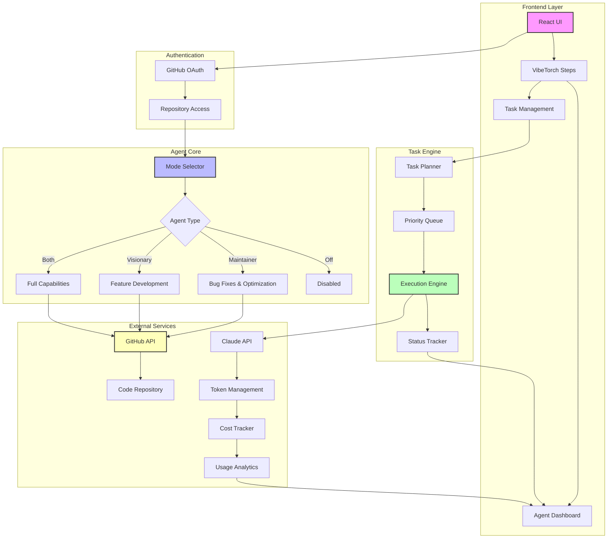
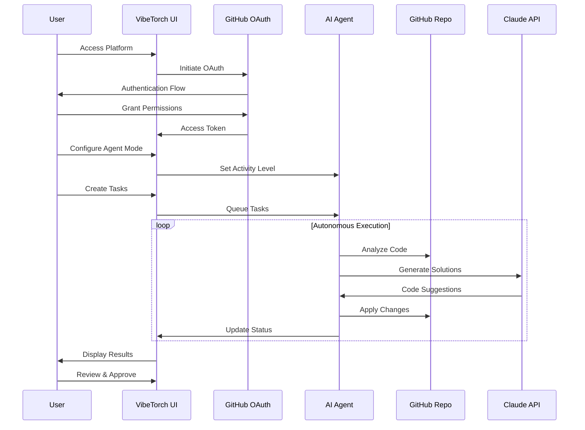

# VibeTorch 🔥

**AI-Powered Autonomous Code Agent Platform**

VibeTorch is an intelligent development automation platform that provides 24/7 AI agents to enhance your coding workflow. With the tagline "Vibe must flow. Rest easy, AI's got the night shift," VibeTorch offers automated code maintenance, optimization, and feature development when you're not around.

## 🚀 Core Features

### 🤖 **Intelligent Agent Modes**
- **Maintainer Mode**: Focuses on bug fixes, code optimization, and maintenance tasks
- **Visionary Mode**: Suggests new features, architecture improvements, and innovations  
- **Both Mode**: Full AI capabilities combining maintenance and visionary features
- **Off Mode**: Disable AI agent for all repositories

### 📋 **Task Management System**
- Plan and track work before agent execution
- Interactive task table with status tracking (Pending, In Progress, Completed, Blocked)
- Real-time task editing and status updates
- Task analytics and progress monitoring

### 📊 **Real-time Dashboard**
- Live monitoring of AI agent activities
- Token usage tracking and cost analysis
- Repository status indicators
- Performance metrics and optimization insights

### 🔗 **GitHub Integration**
- Seamless OAuth authentication
- Multi-repository support
- Automatic code analysis and suggestions
- Pull request automation

## 🛠 User Flow

### 1. **Authentication & Setup**
```
User visits VibeTorch → GitHub OAuth → Repository Access Granted
```

### 2. **Agent Configuration**
```
Select Agent Mode → Configure Activity Level → Connect Repositories
```

### 3. **Task Planning**
```
Create Tasks → Set Priorities → Define Success Criteria
```

### 4. **Autonomous Execution**
```
AI Agent Analyzes Code → Executes Tasks → Reports Results
```

### 5. **Monitoring & Review**
```
Real-time Dashboard → Review Changes → Approve/Reject → Iterate
```

## 🏗 System Architecture



## 📈 Technical Flow



## 🎯 Key Benefits

- **24/7 Automation**: AI works while you sleep
- **Smart Task Management**: Organized workflow with status tracking
- **Cost Transparency**: Real-time token usage and cost monitoring
- **Flexible Modes**: Customize AI behavior to your needs
- **GitHub Integration**: Seamless repository management

## 🔧 Tech Stack

- **Frontend**: React, TypeScript, Tailwind CSS
- **UI Components**: shadcn/ui
- **State Management**: React Hooks
- **Authentication**: GitHub OAuth
- **AI Provider**: Claude API
- **Build Tool**: Vite
- **Styling**: Custom design system with consistent color palette

## 🚦 Getting Started

1. **Clone the repository**
```bash
git clone <repository-url>
cd vibetorch
```

2. **Install dependencies**
```bash
npm install
```

3. **Start development server**
```bash
npm run dev
```

4. **Visit the application**
```
http://localhost:5173
```

## 📊 Usage Metrics

- **Token Tracking**: Monitor Claude API usage
- **Cost Analysis**: Real-time spending insights  
- **Task Analytics**: Success rates and completion times
- **Repository Health**: Code quality improvements

---

*VibeTorch - Where AI meets productivity. Let your code vibe while you rest.* 🌙✨